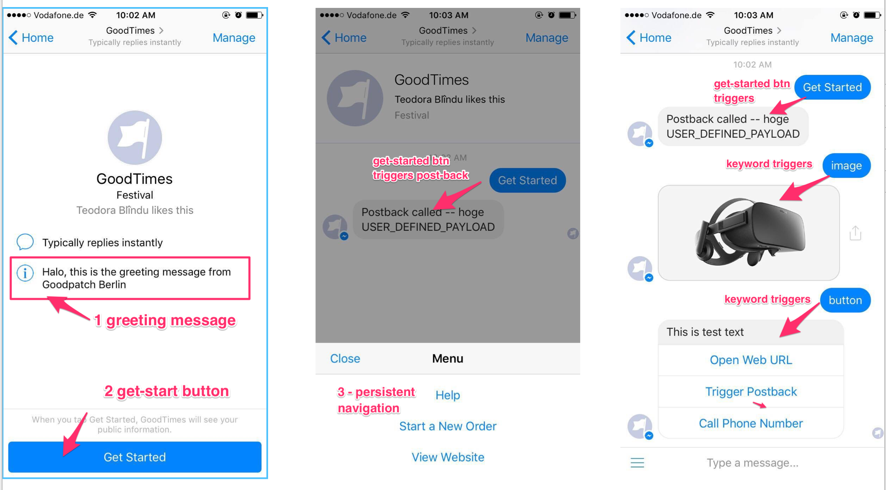
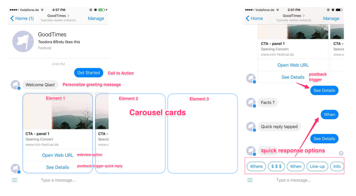
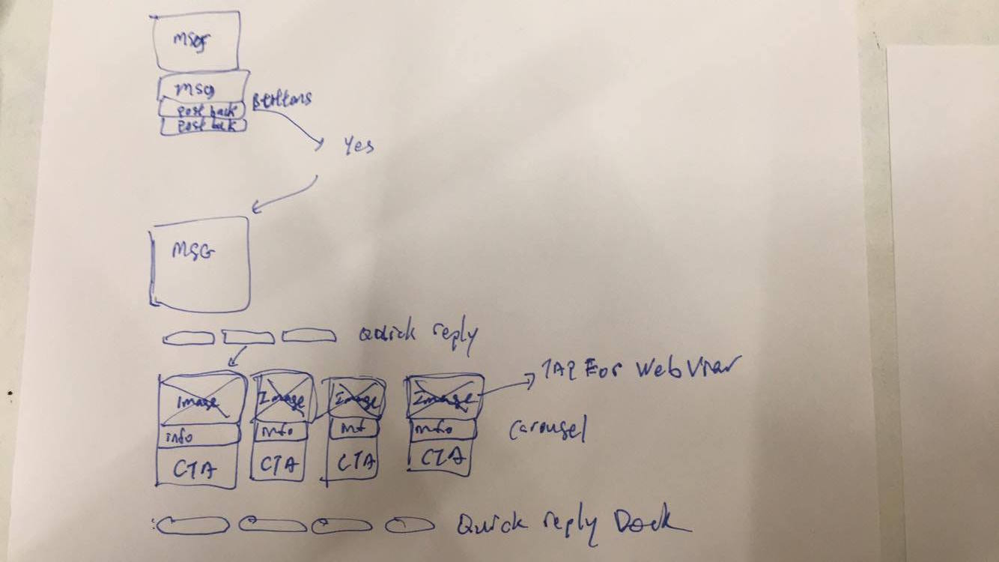

quick sample app built on top of the Facebook chatbot sample repository
Quickstart w/ Chatbot for FB Messenger

Sample app
https://developers.facebook.com/docs/messenger-platform/guides/quick-start

- [x] Git Clone into Sample app
- [x] Create a Facebook Page (for example .... GoodTimes)
- [x] Register app to Page on Developer dashboard, select the basic subscription model for messages, message_postback

- [x] Host Sample app on Https domain (Heroku) and register callback domain
- [x] modified Config file to include all the credentials
- [x] register the url and setup the webhook (step 2 of the Quickstart guide)
- [x] add page on messenger to see start screen

starts modification

1 - greeting message
2 - get started button (POST trigger for first steps, user is already authorize)
3 - persistent navigation, set once with POST/ to modified later with DELETE requests

#### conversation flow

types of triggers

 -  user types keyword to invoke certain action
 -  button selections for post_back
https://developers.facebook.com/docs/messenger-platform/product-overview/conversation

- [x] Thread Setup

General Flow of existing News Bots WJS, CNN
)

### USER Profile

https://developers.facebook.com/docs/messenger-platform/user-profile

- [ ] Send a Message
- [ ] Receive Messages
- [ ] Sender Actions
- [ ] Personalize the experience
